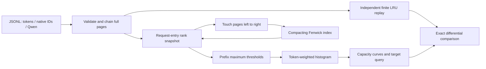

# PrefixScope

[简体中文](README_zh.md) · [Research](docs/en/RESEARCH.md) · [Experiments](docs/en/EXPERIMENTS.md) · [Code walkthrough](docs/en/WALKTHROUGH.md)


**An auditable CPU tool for prefix-cache capacity curves, with a compacting Fenwick index and exact finite-LRU validation.**

I want to understand how much reusable prompt context a cache budget retains, without repeatedly replaying the same trace for every capacity. I chose this problem because it connects algorithm analysis, resource management and reproducible systems experiments. The immediate research context is [KVSET, submitted 23 September 2026](https://arxiv.org/abs/2609.27746v1), in the week of this project's initial implementation. This is an independent engineering implementation of existing stack-analysis ideas, not a new cache principle or a reproduction of the entire KVSET system.

## Who it is for

Inference researchers and engineers comparing fixed cache budgets on request traces. Supply full-page prefix identities, token IDs, or the public Qwen/Bailian trace schema; obtain token-weighted prefix residency curves and the minimum capacity for a feasible target.

This tool **does not run model inference**. Its exactness is relative to a serial, unpinned, fixed-size page-LRU model. It does not predict vLLM exactly, simulate concurrent scheduling, establish TTFT improvements, compress KV tensors, or evaluate output quality.

## What is implemented

- One-pass request-entry rank analysis with prefix-maximum thresholds; a histogram answers many capacities without one replay per capacity.
- A switchable compacting Fenwick time axis: rank-index storage follows distinct historical pages, rather than all accesses. A cold stream still grows with distinct pages.
- A separate `OrderedDict` finite-LRU oracle, randomized all-capacity tests, bounded JSONL ingestion, namespace-aware chain hashing, reset/reuse and fail-atomic budget rejection.
- Hash-pinned public production-derived trace subsets, synthetic counterexamples, raw repeats, isolated process RSS, bilingual tables and figures, and package/CI/container configuration.

The default runtime has **zero third-party Python dependencies**. Tests and charts use the locked development environment. Verified platforms and check status are recorded in [acceptance evidence](results/acceptance/checks.json), [environment](results/environment.json) and [release status](docs/en/RELEASE.md).

## Architecture



For request page `j`, let `d_j` be its **1-based rank before any page in that request is touched**, or infinity when unseen. The reusable-prefix threshold is `t_j = max(d_1, ..., d_j)`. At capacity `C`, reuse is `block_size × sum(1[t_j <= C])`. The denominator includes incomplete tail tokens; only complete blocks can be reused. All pages are subsequently touched from left to right.

Compaction preserves timestamp order, hence every rank. With `U` distinct pages and initial size `S0`, allocated rank slots are at most `max(S0, 4U)`; amortized page-update cost is `O(log(U+S0))`. Histogram queries also have sorting cost. [Proof, complexity and model limits](docs/en/RESEARCH.md).

## Install and quick start

Python 3.11+ on macOS/Linux; this delivery was executed locally on Python 3.12.2, Apple M1 Pro, 16 GiB RAM. No model, API key or download is needed for the demo or default tests.

```bash
python3 -m venv .venv
.venv/bin/python -m pip install --require-hashes -r requirements.lock
.venv/bin/python -m pip install --no-build-isolation -e .
make demo
.venv/bin/python -m prefixscope analyze examples/tokens.jsonl --format tokens --namespace demo --capacities 0,4,5,16,64 --output results/local-demo.json
make check test build
```

The demo hashes complete token blocks, calculates a real curve, and requires exact equality with finite LRU before returning `status: passed`.

```python
from prefixscope import Profile, Request

profile = Profile(max_unique_pages=1000)
profile.observe(Request(("model-tenant-prefix-a", "model-tenant-prefix-ab"), 32))
profile.observe(Request(("model-tenant-prefix-a", "model-tenant-prefix-ab"), 33))
print(profile.curve([0, 1, 2]))
print(profile.minimum_capacity(0.4))
```

Native IDs are trusted identities: the caller must encode namespace and preceding context. Prefer `prefixscope.trace.from_tokens` or the Qwen adapter when constructing identities. [API behavior and errors](docs/en/WALKTHROUGH.md).

## Benchmark results

The frozen primary target was **at least 2× analysis speedup** over practical finite-LRU replay for **each** A/B 2048-request workload at 64 capacities. The memory target was **at most 0.25× allocated Fenwick slots** on the 20,000-request hot loop. Exact reused-token equality is mandatory. Targets were committed before implementation; the [contract](experiments/contract.json) has not been retuned after measurement.

The timed scope includes fresh analyzer initialization, request processing and curve construction. File I/O, normalization and source hashing are recorded separately. These are **analysis benchmarks, not end-to-end model-serving results**. The baseline and optimized methods use the same inputs, page size, capacities and one execution thread. Five repeats are insufficient for a p99 claim; all individual samples and min–max ranges are retained.

<!-- RESULTS:START -->

Measured analysis time: median of five repetitions per method (compact min–max in parentheses). Speedup is LRU / compact; below 1 is slower.

| Workload | Capacities | Compact ms (range) | Unbounded ms | LRU ms | Speedup | Status |
|---|---:|---:|---:|---:|---:|---|
| qwen_traceA_256 | 1 | 60.92 (59.86–68.67) | 61.22 | 4.24 | 0.07× | passed |
| qwen_traceA_256 | 8 | 61.96 (59.67–63.57) | 62.53 | 34.43 | 0.56× | passed |
| qwen_traceA_256 | 64 | 62.53 (59.62–64.56) | 63.40 | 329.58 | 5.27× | passed |
| qwen_traceA_2048 | 1 | 716.44 (714.78–767.49) | 770.25 | 37.60 | 0.05× | passed |
| qwen_traceA_2048 | 8 | 745.22 (718.01–842.08) | 770.10 | 327.17 | 0.44× | passed |
| qwen_traceA_2048 | 64 | 761.55 (753.19–814.83) | 762.39 | 4314.70 | 5.67× | passed |
| qwen_traceB_256 | 1 | 30.97 (30.54–36.59) | 30.86 | 2.05 | 0.07× | passed |
| qwen_traceB_256 | 8 | 30.81 (29.79–32.33) | 30.99 | 16.91 | 0.55× | passed |
| qwen_traceB_256 | 64 | 39.29 (32.39–47.88) | 36.92 | 194.43 | 4.95× | passed |
| qwen_traceB_2048 | 1 | 453.34 (372.00–516.31) | 405.47 | 18.38 | 0.04× | passed |
| qwen_traceB_2048 | 8 | 593.06 (348.70–706.80) | 572.80 | 195.37 | 0.33× | passed |
| qwen_traceB_2048 | 64 | 437.09 (391.49–528.24) | 454.41 | 2347.14 | 5.37× | passed |
| hot_loop_20000 | 1 | 1876.09 (915.95–2466.53) | 1787.44 | 97.25 | 0.05× | passed |
| hot_loop_20000 | 8 | 940.32 (818.95–1119.35) | 1830.39 | 370.38 | 0.39× | passed |
| hot_loop_20000 | 64 | 1056.91 (921.75–1205.31) | 1420.21 | 2834.92 | 2.68× | passed |
| cold_scan_4096 | 1 | 147.73 (132.42–167.20) | 162.08 | 15.44 | 0.10× | passed |
| cold_scan_4096 | 8 | 157.68 (136.30–205.58) | 199.24 | 119.58 | 0.76× | passed |
| cold_scan_4096 | 64 | 144.04 (135.71–213.71) | 145.18 | 2423.12 | 16.82× | passed |
| mixed_chat_2048 | 1 | 225.48 (212.02–244.05) | 228.39 | 10.93 | 0.05× | passed |
| mixed_chat_2048 | 8 | 369.79 (316.08–412.97) | 339.44 | 141.37 | 0.38× | passed |
| mixed_chat_2048 | 64 | 402.47 (239.65–685.46) | 582.48 | 1684.10 | 4.18× | passed |
| short_requests_4096 | 1 | 15.90 (14.07–17.09) | 16.05 | 3.01 | 0.19× | passed |
| short_requests_4096 | 8 | 17.21 (16.24–21.12) | 17.86 | 11.57 | 0.67× | passed |
| short_requests_4096 | 64 | 15.59 (14.96–16.31) | 15.54 | 90.04 | 5.78× | passed |

| Frozen target | Target | Measured | Outcome |
|---|---:|---:|---|
| qwen_traceA_2048 | >= 2.00× | 5.6657 | met |
| qwen_traceB_2048 | >= 2.00× | 5.3700 | met |
| hot_loop_20000 | <= 0.25 | 0.0020 | met |

The memory target counts allocated Fenwick slots, separately from process peak RSS.

Apple M1 Pro · Darwin 25.6.0 · Python 3.12.2 · 1 thread · run `c89dbb47-d85d-4866-9cdc-8b469be1c9aa`.

<!-- RESULTS:END -->


[All raw repeats](results/benchmark.json) · [Machine-readable summary](results/summary.json) · [Detailed protocol, capacity curves, RSS and failures](docs/en/EXPERIMENTS.md)

```bash
make fetch
make benchmark
make analyze
.venv/bin/python scripts/plot_capacity.py results/benchmark.json
.venv/bin/python scripts/analyze_results.py results/benchmark.json --update-readme
```

`make fetch` downloads about 153 MB from a fixed official revision and validates whole-file SHA-256. The benchmark selects the first 256/2048 records, with no performance-based filtering. Public trace records are real and anonymized; serialization into this cache model is a modeling choice. Synthetic hot, cold, mixed and short traces are labeled separately. Raw downloads are excluded from Git and packages.

## Limits and maintenance

A single-capacity replay can be faster. Compaction adds work and cannot bound memory independently of distinct historical pages. A configured unique-page limit rejects a request before mutation; a process-level out-of-memory exception requires discarding the instance. A profile has one owner; callers must serialize concurrent use.

Capacity is constant across the analyzed history. Namespace separation does not create separate cache pools. Output-page identities, engine pinning, arrival/completion overlap, hybrid models, variable-size pages and eviction policies other than the stated LRU model are outside this version. A hash is not a privacy guarantee. [Security and limits](SECURITY.md).

I plan to keep the baseline, source-bound measurements and bilingual explanations together as the project develops. Future engine adapters need independent event-level validation before any engine-level claims.

## Documentation and release materials

| Guide | Purpose |
|---|---|
| [Research](docs/en/RESEARCH.md) | Weekly topic selection, related work, math and originality limits |
| [Architecture](docs/en/ARCHITECTURE.md) | Modules, interfaces, resources and alternatives |
| [Experiments](docs/en/EXPERIMENTS.md) | Complete protocol, measured results and negative cases |
| [Development](docs/en/DEVELOPMENT.md) | Actual engineering activity and real commit references |
| [Walkthrough](docs/en/WALKTHROUGH.md) | Entry-to-algorithm maintenance guide and API |
| [Release](docs/en/RELEASE.md) | Reproduction, packaging, release draft, About and Topics |
| [Resume and talk](docs/en/RESUME.md) | Evidence-linked project descriptions and explanation |

The source is [MIT-licensed](LICENSE). Public Qwen data retains Apache-2.0 terms. See [NOTICE](NOTICE.md), [CITATION.cff](CITATION.cff), and [contribution guide](CONTRIBUTING.md). Citation metadata describes software version 0.1.0; it does not imply a paper publication or DOI.
