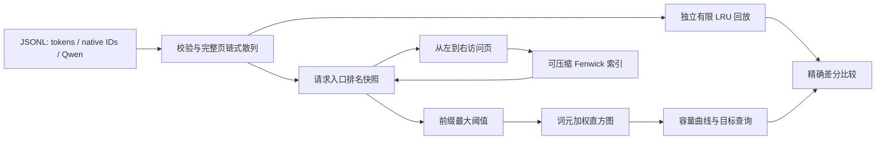
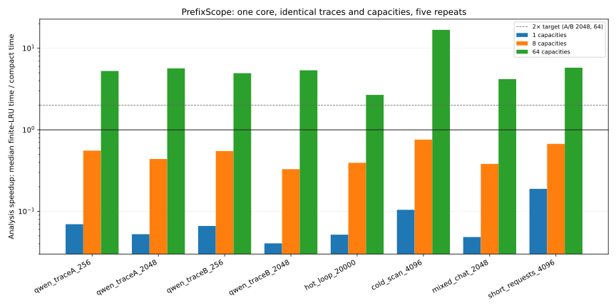

# PrefixScope

[GitHub](https://github.com/hardwork-xu/prefixscope) · [CI](https://github.com/hardwork-xu/prefixscope/actions/workflows/ci.yml)

[English](README.md) · [研究说明](docs/zh/RESEARCH.md) · [实验记录](docs/zh/EXPERIMENTS.md) · [代码导读](docs/zh/WALKTHROUGH.md)


**可审计的 CPU 前缀缓存容量分析工具：采用可压缩 Fenwick 索引，以独立有限 LRU 验证精确结果。**

我希望了解不同缓存预算能保留多少可复用提示词上下文，而不必为每个容量重复回放整份轨迹。这个问题将算法分析、资源管理和可复现实验结合起来。直接研究背景是项目首次实现当周、[2026 年 9 月 23 日提交的 KVSET](https://arxiv.org/abs/2609.27746v1)。本项目是已有栈分析思想的独立工程实现，不宣称新缓存原理，也不声称复现完整 KVSET 系统。

## 适用对象

适合用请求轨迹比较固定缓存预算的推理系统研究者和工程师。输入完整页的前缀身份、词元 ID 或公开 Qwen/Bailian 轨迹，输出按词元加权的前缀驻留曲线，以及达到可行目标所需的最小容量。

本工具**不执行模型推理**。精确性仅限于串行、无引用固定、固定页大小的 page-LRU 模型；不精确预测 vLLM，不模拟并发调度，不证明 TTFT 提升，不压缩 KV 张量，也不评估输出质量。

## 实际实现

- 一次扫描计算请求入口排名与前缀最大阈值；直方图回答多个容量，无需每个容量单独重放。
- 可以关闭的 Fenwick 时间轴压缩：排名索引空间随历史不同页数增长，而非全部访问次数。全冷负载仍会随不同页数增长。
- 独立 `OrderedDict` 有限 LRU 基线、随机全容量差分测试、有界 JSONL 输入、带命名空间的链式散列、清理重用及预算拒绝的状态原子性。
- 哈希固定的公开生产来源轨迹子集、合成反例、完整重复样本、独立进程 RSS、双语表格和图表，以及包、CI、容器配置。

默认运行时**没有第三方 Python 依赖**。测试和绘图使用锁定的开发环境。验证平台与检查状态见[验收证据](results/acceptance/checks.json)、[环境记录](results/environment.json)和[发布状态](docs/zh/RELEASE.md)。

## 架构



对于请求的第 `j` 页，`d_j` 是**该请求任何页更新之前、从 1 开始的栈排名**，从未见过则为无穷。可复用前缀阈值为 `t_j = max(d_1, ..., d_j)`。容量 `C` 下复用量为 `block_size × sum(1[t_j <= C])`。分母包含不足一页的尾部词元，只有完整块可复用。随后所有页均从左到右更新访问顺序。

压缩保留时间戳相对顺序，因此保留全部排名。历史不同页数为 `U`、初始槽位数为 `S0` 时，排名槽位不超过 `max(S0, 4U)`；单页更新的摊还复杂度为 `O(log(U+S0))`。直方图查询另有排序开销。[证明、复杂度与模型边界](docs/zh/RESEARCH.md)。

## 安装与快速开始

要求 macOS/Linux 上的 Python 3.11+；本次本机验证使用 Python 3.12.2、Apple M1 Pro、16 GiB 内存。默认示例和测试不需要模型、API 密钥或数据下载。

```bash
python3 -m venv .venv
.venv/bin/python -m pip install --require-hashes -r requirements.lock
.venv/bin/python -m pip install --no-build-isolation -e .
make demo
.venv/bin/python -m prefixscope analyze examples/tokens.jsonl --format tokens --namespace demo --capacities 0,4,5,16,64 --output results/local-demo.json
make check test build
```

示例会散列完整词元块、真实计算曲线，并要求与有限 LRU 完全一致后才返回 `status: passed`。

```python
from prefixscope import Profile, Request

profile = Profile(max_unique_pages=1000)
profile.observe(Request(("model-tenant-prefix-a", "model-tenant-prefix-ab"), 32))
profile.observe(Request(("model-tenant-prefix-a", "model-tenant-prefix-ab"), 33))
print(profile.curve([0, 1, 2]))
print(profile.minimum_capacity(0.4))
```

原生 ID 是受信任的身份，调用者必须包含命名空间和前置上下文。构造身份时优先使用 `prefixscope.trace.from_tokens` 或 Qwen 适配器。[API 行为与异常](docs/zh/WALKTHROUGH.md)。

## 基准实测结果

冻结的主要目标是：A/B 各 2048 请求、64 个容量点的**每个负载**，相对实用有限 LRU 回放至少获得 **2 倍分析加速**。内存目标为 20,000 请求热点循环的 **Fenwick 已分配槽位不超过未压缩版的 0.25 倍**。复用词元数必须完全一致。目标在实现前提交，[实验约定](experiments/contract.json)未根据结果调整。

计时包含新分析器初始化、请求处理及曲线构建。文件读取、规范化和来源散列单独记录。这是**分析器基准，不是模型服务端到端实验**。基线和优化方案使用相同输入、页大小、容量和单执行线程。五次重复不足以宣称 p99，保留全部单次样本及最小—最大范围。

<!-- RESULTS:START -->

实际分析时间；每个方法五次重复的中位数（括号为 compact 最小–最大值）。 加速比为 LRU / compact；小于 1 表示较慢。

| 工作负载 | 容量数 | Compact ms（范围） | Unbounded ms | LRU ms | 加速比 | 状态 |
|---|---:|---:|---:|---:|---:|---|
| qwen_traceA_256 | 1 | 60.92 (59.86–68.67) | 61.22 | 4.24 | 0.07× | passed |
| qwen_traceA_256 | 8 | 61.96 (59.67–63.57) | 62.53 | 34.43 | 0.56× | passed |
| qwen_traceA_256 | 64 | 62.53 (59.62–64.56) | 63.40 | 329.58 | 5.27× | passed |
| qwen_traceA_2048 | 1 | 716.44 (714.78–767.49) | 770.25 | 37.60 | 0.05× | passed |
| qwen_traceA_2048 | 8 | 745.22 (718.01–842.08) | 770.10 | 327.17 | 0.44× | passed |
| qwen_traceA_2048 | 64 | 761.55 (753.19–814.83) | 762.39 | 4314.70 | 5.67× | passed |
| qwen_traceB_256 | 1 | 30.97 (30.54–36.59) | 30.86 | 2.05 | 0.07× | passed |
| qwen_traceB_256 | 8 | 30.81 (29.79–32.33) | 30.99 | 16.91 | 0.55× | passed |
| qwen_traceB_256 | 64 | 39.29 (32.39–47.88) | 36.92 | 194.43 | 4.95× | passed |
| qwen_traceB_2048 | 1 | 453.34 (372.00–516.31) | 405.47 | 18.38 | 0.04× | passed |
| qwen_traceB_2048 | 8 | 593.06 (348.70–706.80) | 572.80 | 195.37 | 0.33× | passed |
| qwen_traceB_2048 | 64 | 437.09 (391.49–528.24) | 454.41 | 2347.14 | 5.37× | passed |
| hot_loop_20000 | 1 | 1876.09 (915.95–2466.53) | 1787.44 | 97.25 | 0.05× | passed |
| hot_loop_20000 | 8 | 940.32 (818.95–1119.35) | 1830.39 | 370.38 | 0.39× | passed |
| hot_loop_20000 | 64 | 1056.91 (921.75–1205.31) | 1420.21 | 2834.92 | 2.68× | passed |
| cold_scan_4096 | 1 | 147.73 (132.42–167.20) | 162.08 | 15.44 | 0.10× | passed |
| cold_scan_4096 | 8 | 157.68 (136.30–205.58) | 199.24 | 119.58 | 0.76× | passed |
| cold_scan_4096 | 64 | 144.04 (135.71–213.71) | 145.18 | 2423.12 | 16.82× | passed |
| mixed_chat_2048 | 1 | 225.48 (212.02–244.05) | 228.39 | 10.93 | 0.05× | passed |
| mixed_chat_2048 | 8 | 369.79 (316.08–412.97) | 339.44 | 141.37 | 0.38× | passed |
| mixed_chat_2048 | 64 | 402.47 (239.65–685.46) | 582.48 | 1684.10 | 4.18× | passed |
| short_requests_4096 | 1 | 15.90 (14.07–17.09) | 16.05 | 3.01 | 0.19× | passed |
| short_requests_4096 | 8 | 17.21 (16.24–21.12) | 17.86 | 11.57 | 0.67× | passed |
| short_requests_4096 | 64 | 15.59 (14.96–16.31) | 15.54 | 90.04 | 5.78× | passed |

| 预设目标 | Target | Measured | 结论 |
|---|---:|---:|---|
| qwen_traceA_2048 | >= 2.00× | 5.6657 | 达标 |
| qwen_traceB_2048 | >= 2.00× | 5.3700 | 达标 |
| hot_loop_20000 | <= 0.25 | 0.0020 | 达标 |

内存目标统计 Fenwick 已分配槽位比例，与进程峰值 RSS 分开。

Apple M1 Pro · Darwin 25.6.0 · Python 3.12.2 · 1 thread · run `c89dbb47-d85d-4866-9cdc-8b469be1c9aa`.

<!-- RESULTS:END -->



[全部原始重复样本](results/benchmark.json) · [机器可读摘要](results/summary.json) · [详细协议、容量曲线、RSS 和失败情况](docs/zh/EXPERIMENTS.md)

```bash
make fetch
make benchmark
make analyze
.venv/bin/python scripts/plot_capacity.py results/benchmark.json
.venv/bin/python scripts/analyze_results.py results/benchmark.json --update-readme
```

`make fetch` 从官方固定版本下载约 153 MB，并校验完整文件 SHA-256。基准选取前 256/2048 条，不按性能过滤。公开记录来自真实匿名生产轨迹；将它串行化为本缓存模型是建模选择。热点、全冷、混合和短请求合成轨迹单独标注。原始下载不进入 Git 或软件包。

## 限制与维护

仅分析单个容量时，直接回放可能更快。压缩增加工作量，也无法使内存与历史不同页数无关。配置的页数预算在改变状态前拒绝超限请求；进程内存耗尽后需要丢弃实例。分析器采用单一所有者，调用者必须串行化并发访问。

容量在整段历史中保持固定。命名空间隔离身份，不会建立独立缓存池。输出页身份、引擎引用固定、到达与完成重叠、混合模型、变长页和其他淘汰策略均不属于本版本。散列不构成隐私保证。[安全与限制](SECURITY_zh.md)。

我希望在持续维护中始终让基线、绑定源码的测量和双语解释保持一致。未来的引擎适配器必须先经过独立的事件级验证，才能提出引擎层面的结论。

## 文档与发布材料

| 文档 | 内容 |
|---|---|
| [研究说明](docs/zh/RESEARCH.md) | 当周选题、相关工作、数学与原创性边界 |
| [架构说明](docs/zh/ARCHITECTURE.md) | 模块、接口、资源与替代方案 |
| [实验记录](docs/zh/EXPERIMENTS.md) | 完整协议、实测结果及不利场景 |
| [开发记录](docs/zh/DEVELOPMENT.md) | 实际工程活动与真实提交引用 |
| [代码导读](docs/zh/WALKTHROUGH.md) | 从入口到算法的维护指南与 API |
| [发布材料](docs/zh/RELEASE.md) | 复现、打包、发布说明草稿、About 与 Topics |
| [简历与讲解](docs/zh/RESUME.md) | 可追溯的项目描述与讲解材料 |

源码采用 [MIT 许可证](LICENSE)，公开 Qwen 数据保留 Apache-2.0 条款。另见[来源说明](NOTICE.md)、[CITATION.cff](CITATION.cff)及[贡献指南](CONTRIBUTING_zh.md)。引用元数据描述软件 0.1.0 版本，不意味着论文发表或已有 DOI。
