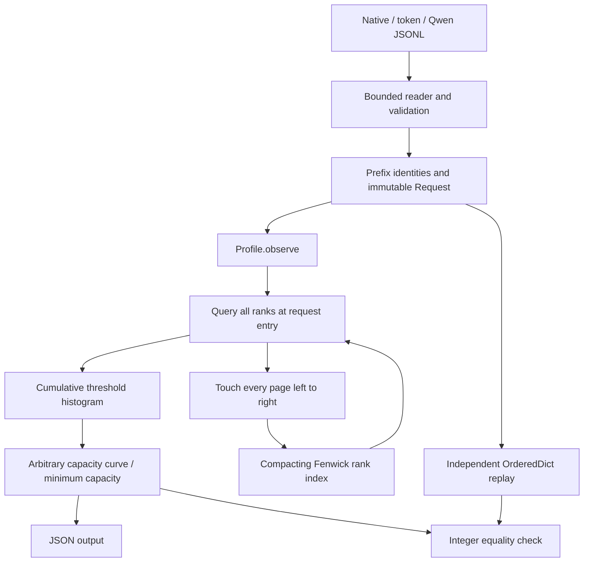

# Architecture and API

[简体中文](../zh/ARCHITECTURE.md) · [Research and proof](RESEARCH.md)

## Data flow



The package has no runtime dependencies outside the Python standard library. The core executes CPU metadata analysis. There is no inference service, model download, GPU kernel or HTTP server in the runtime path.

| Module | Responsibility | Boundary |
|---|---|---|
| [`model.py`](../../src/prefixscope/model.py) | Immutable `Request`; capacity validation | Rejects malformed sizes and repeated page identities. |
| [`trace.py`](../../src/prefixscope/trace.py) | Streaming JSONL; token/content-ID chaining | Converts formats to one model; does not reconstruct source text or outputs. |
| [`rank.py`](../../src/prefixscope/rank.py) | Fenwick ranks; timestamp compaction | Knows page IDs and recency, not requests, tokens or queried capacities. |
| [`profiler.py`](../../src/prefixscope/profiler.py) | Request transitions; histogram; curves | Owns the analysis state and fixed block-size contract. |
| [`reference.py`](../../src/prefixscope/reference.py) | Independent finite LRU caches | Does not call the optimized rank index or histogram. |
| [`cli.py`](../../src/prefixscope/cli.py) | Arguments, analysis orchestration, output | Returns diagnostic status and replaces output files atomically. |

## Public interface

```python
from prefixscope import Profile, Request, ResourceLimitError, replay
from prefixscope.trace import from_tokens, load_jsonl

request = from_tokens(list(range(72)), namespace="example-model-v1")
profile = Profile(max_unique_pages=1000)
profile.observe(request)
profile.observe(request)
assert profile.curve([0, 4]) == replay([request, request], [0, 4])
assert profile.minimum_capacity(0.4) == 4
profile.clear()
```

The example uses synthetic integer tokens: each 72-token request has four full 16-token pages and an uncached eight-token tail. It demonstrates metadata reuse, not language-model inference.

| Interface | Behavior and constraints |
|---|---|
| `Request(blocks, input_tokens, block_size=16)` | Frozen object. `blocks` must be a tuple of distinct, nonempty strings. Integer token count is nonnegative, block size positive, and `len(blocks) == input_tokens // block_size`. Boolean values do not count as integer parameters. |
| `Profile(max_unique_pages=2_000_000, compact=True, initial_slots=1024)` | Creates empty state; validates positive integer limits and boolean compaction. Default slots support the structural-memory ablation. |
| `observe(request, measure=True)` | Returns a tuple of integer prefix thresholds or `None`. `measure=False` warms state without counting tokens. All requests must use the same block size. Invalid requests and unique-page-budget rejection do not change profile state. |
| `curve(capacities)` | Takes a sequence of nonnegative integer page capacities. Returns a list of dictionaries with `capacity_pages`, `reused_tokens`, `total_tokens`, `hit_rate`. Preserves capacity order and duplicates; an empty sequence returns an empty list. |
| `minimum_capacity(target_hit_rate)` | Finite numeric target in `[0,1]`, excluding booleans. Returns the smallest sufficient page count, zero for target zero, or `None` if unattainable. |
| `stats()` | Returns structural counters. `requests` and `accesses` include warmup; `measured_requests` and `total_tokens` exclude it. `allocated_slots` excludes the unused index-zero array element and is not RSS. |
| `clear()` | Drops old state and allocates a new initial index. Resets histogram, counters and block size, allowing another analysis. It does not promise an immediate OS-level RSS decrease. |
| `replay(requests, capacities, warmup_requests=0)` | Reference iterable API, one `OrderedDict` cache per capacity, matching curve schema. Warmup updates caches without measurement. |

Type/shape violations produce `TypeError` or `ValueError`; `ResourceLimitError` is a `ValueError` subclass specifically identifying the distinct-page budget. `Profile` is a **single-owner mutable object** with no internal locking. Separate independent profiles can be used by separate workers; sharing one across threads requires external serialization of entire requests.

## Input formats and identities

`load_jsonl(path, format="native", limit=None, namespace="default", max_line_bytes=16*1024*1024)` yields validated requests in file order. `limit=0` yields none. Each line must be a JSON object; blank lines are errors, not silently skipped. Errors name the 1-based line number. File handles close when iteration finishes or the generator is closed; callers stopping early should explicitly close the generator or use `contextlib.closing`.

| Format | Required fields | Transformation |
|---|---|---|
| `native` | `blocks`, `input_tokens`; optional `block_size` | Already canonical page IDs; unknown fields are rejected. The caller owns identity correctness. |
| `tokens` | `token_ids`; optional `block_size` | Hashes complete blocks of nonnegative integer token IDs and then chains their parent identities. Keeps incomplete tokens in the denominator. |
| `qwen` | `input_length`, `hash_ids` | Fixed block size 16; selects the first `floor(input_length/16)` hashes, chains them, and ignores unrelated trace metadata. |

`chain_blocks` combines a format marker, namespace, block size, parent digest, integer encoding length and content ID using SHA-256. Thus equal content following different prefixes receives different identities. A namespace must be 1–1024 characters and must distinguish model, tokenizer, adapter, dtype and tenant when those differ. The default is convenient for a single trace; it is not automatic model detection. Native IDs bypass this mechanism and must already include the necessary identity boundaries. Collision resistance is an assumption, not a mathematical equality oracle.

## State transitions and resource management

At `observe` entry, input type, measurement flag, block-size consistency and prospective distinct-page count are checked before mutation. Then all page ranks are read, prefix maxima are accumulated into the histogram for measured requests, every page is touched, and counters advance. A first cold page closes the reusable prefix, but subsequent pages still affect future recency.

The compact rank array stores signed 64-bit counts; the dictionary holds each page's current position. Compaction preserves the chronological order of occupied positions. The histogram retains only finite thresholds and token weights, with no per-request record. See [the proof and amortized bounds](RESEARCH.md#complexity-and-resource-costs).

Default ingestion bounds are **16 MiB per JSONL line**, **100,000 complete pages per request**, and **2,000,000 distinct pages per profile**. The first two apply to `trace.py` conversion; direct `Request` construction has structural validation but no automatic 100,000-page limit. The caller must bound directly supplied requests. `max_unique_pages` bounds known identities, not bytes; long native strings and a large `initial_slots` allocation can still consume substantial memory.

Budget rejection is atomic with respect to profile state and can be recovered by using a larger budget or different input. **System-level `MemoryError` is not transactional:** an allocation can fail after partial mutation. Discard that profile and replay from a known input boundary in a fresh profile/process. There is no persisted checkpoint, silent eviction of analysis history or automatic data loss to satisfy the budget.

## CLI and output lifecycle

`prefixscope demo` runs the synthetic example and checks its curve against reference replay. `prefixscope analyze --help` documents bilingual arguments for format, namespace, capacity pages, warmup, request limit, unique-page limit, target and output path. Known operational errors return status **2** with a diagnostic; success returns **0**. A target that cannot be reached is valid output with JSON `null`, not a failed run.

With `--output`, the CLI serializes finite JSON, writes a temporary file in the destination directory, then uses `os.replace`. Expected exceptions remove remaining temporary files. This protects an existing output from ordinary incomplete writes; it is not an fsync-based power-loss durability guarantee. Default stdout output is not atomic. JSON outputs include `schema_version` and the model identifier `serial-request-entry-lru`.

## Design tradeoffs and security boundary

- `OrderedDict` is the practical baseline: direct membership checks and constant-time recency operations can win for few capacities. Replaying every capacity is also useful as an independent correctness oracle.
- A treap could store only live ranks, but requires rotations, balancing and more objects. Compact Fenwick arrays keep the data structure inspectable and expose a clean compaction-off ablation; sorting pauses are an accepted tradeoff.
- Histogram aggregation avoids storing all requests and capacity-specific counters. It deliberately cannot answer per-request historical queries or reconstruct workload timing after ingestion.
- The runtime reads local files and writes requested results. It does not upload traces. Namespace hashing is identity separation, **not encryption or anonymization**; private token IDs, traces and derived statistics require their own handling rules. Do not publish them merely because IDs were hashed.
- Bounded input validation mitigates accidental resource use, but the program is not a sandbox for hostile data. No claim is made about multi-tenant serving isolation or resistance to timing attacks.
- Production vLLM/SGLang compatibility, inference acceleration, GPU execution, variable-size caches and concurrent scheduling are outside the current model; see [research scope](RESEARCH.md#data-validity-and-external-validity).
