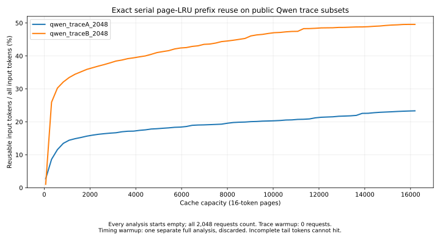
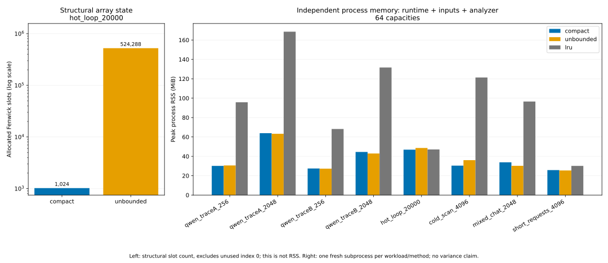

# Experiments and evidence

[简体中文](../zh/EXPERIMENTS.md) · [Research assumptions](RESEARCH.md) · [Architecture](ARCHITECTURE.md)

## Frozen hypotheses and verdict

The [pre-experiment contract](../../experiments/contract.json) was committed before implementation and performance measurement. The primary question is whether one rank/histogram analysis is useful when many cache capacities must be evaluated. The separate engineering hypothesis is that timestamp compaction bounds array storage on a long trace with a small recurring working set. The original targets were retained after observing results.

| Target established before measurement | Measured result | Verdict |
|---|---:|---|
| At least 2.00× median analysis speedup over independent OrderedDict LRU, Qwen A first 2,048 requests, 64 capacities | 5.6657× | Met |
| Same requirement, independently, Qwen B first 2,048 requests | 5.3700× | Met |
| Compact/unbounded allocated Fenwick slots ≤0.25 on `hot_loop_20000` | 1,024 / 524,288 = 0.001953125 | Met |
| Exact reused-token equality with independent finite-capacity LRU | Zero difference in all 360 timed samples | Met for this experiment |

These are **analysis** results. They are not model inference acceleration, production cache hit-rate forecasts, or evidence of superiority over KVSET. The array bound is an engineering property tested separately from process RSS; it does not mean process memory fell by 99.8%.

## Run, source and environment

The complete run took 281.35 seconds, including normalization, oracle calculation, timing warmups, timed measurements and memory subprocesses. It began at `2026-09-26T16:45:27.130526+00:00` and ended at `2026-09-26T16:50:08.485693+00:00`.

| Evidence field | Value |
|---|---|
| Run ID | `c89dbb47-d85d-4866-9cdc-8b469be1c9aa` |
| Git revision recorded at measurement | `9bcdd46dc083eeb0823e0cdf315667b91273c717` |
| Tested-source SHA-256 | `503a3a6f292032d8a551a1d60dd88eb9291abc7beb0b8481f82f4125a2cb5cff` |
| Source hash scope | `src/**/*.py`, `benchmark.py`, `experiments/contract.json`; ordered path, NUL, bytes, NUL |
| Working tree at measurement | Dirty; the source hash identifies the exact tested files independently of other working-tree files |
| CPU / architecture | Apple M1 Pro / arm64; 10 logical CPUs available |
| Execution | CPython 3.12.2, Darwin 25.6.0; one analysis thread |
| Timer / seed | `perf_counter_ns` / `20260927` |

[Raw JSON](../../results/benchmark.json) is authoritative. The [generated summary](../../results/summary.json), [complete 24-row table](../../results/table.en.md) and [speedup plot](../../assets/benchmark.svg) are derived from it. [`benchmark.py`](../../benchmark.py) records source identity, input digests, every sample, randomized method orders, correctness, failures and memory measurements. [`analyze_results.py`](../../scripts/analyze_results.py) regenerates the tables and README result sections. Document or plot changes outside the source-hash scope do not change which implementation was measured.

## Data and workloads

The real-input experiments use the [Qwen-Bailian anonymous usage traces](https://github.com/alibaba-edu/qwen-bailian-usagetraces-anon/tree/5f7439c51ec248a0c585f7d90a41a6f57773b912), pinned to revision `5f7439c51ec248a0c585f7d90a41a6f57773b912`. The upstream dataset is Apache-2.0; see [NOTICE](../../NOTICE.md) and the [retained license](../../third_party/QWEN_DATA_LICENSE). No weights or pretrained model are used. The download helper checks the complete file hashes:

- Trace A: `07cedc9ed8aff301994ac68ed4aede8123b7603673575eeba9dd677de663db17`.
- Trace B: `68e3f98e2d601d60d0abf4b89bc8a3654372abab7b1cde6373a13d0054379d59`.

Selection is the first 256 or 2,048 records in file order, without sorting or selection by observed performance. Full 16-token blocks are selected using `floor(input_length/16)` and their supplied content IDs are chained with the parent identity, block size and a trace-specific namespace. Incomplete tail tokens remain in the denominator but cannot hit. This is a declared transformation of anonymous block IDs, not reconstruction of text or production scheduling. The original output lengths, timestamps and concurrent timing do not enter the serial model.

Every workload also records the SHA-256 of the exact normalized requests: one compact UTF-8 JSON object plus LF per request, in analysis order. Those hashes distinguish the selected subset and identity transformation from the full downloaded-file hash.

| Workload | Provenance and construction | Requests | Full-block accesses | Input tokens |
|---|---|---:|---:|---:|
| `qwen_traceA_256` | Public real trace, first 256 | 256 | 26,402 | 424,211 |
| `qwen_traceA_2048` | Public real trace, first 2,048 | 2,048 | 239,141 | 3,841,320 |
| `qwen_traceB_256` | Public real trace, first 256 | 256 | 13,409 | 216,572 |
| `qwen_traceB_2048` | Public real trace, first 2,048 | 2,048 | 107,652 | 1,738,379 |
| `hot_loop_20000` | Synthetic; eight recurring groups of 16 pages, 128 unique IDs | 20,000 | 320,000 | 5,270,000 |
| `cold_scan_4096` | Synthetic; 16 previously unseen pages per request | 4,096 | 65,536 | 1,079,296 |
| `mixed_chat_2048` | Synthetic; 32 groups with 24 shared pages plus eight new pages per request | 2,048 | 65,536 | 1,063,936 |
| `short_requests_4096` | Synthetic; 0/1 complete page, 1,024-ID sampling pool, incomplete tails | 4,096 | 3,584 | 88,064 |

Synthetic requests add `request_index % 16` tail tokens. This deliberately tests a denominator larger than the reusable full-block portion. Synthetic IDs and request counts describe metadata workloads only; “chat” does not mean a real language model generated conversations.

## Measurement protocol and fairness

Each workload is evaluated at 1, 8 and 64 capacities. For a count `K`, capacities are `64 + 256*i` pages for `i=0..K-1`. Thus the 64-capacity range is 64–16,192 pages. The same normalized immutable request list, block size, token denominator, capacity grid and single-thread setting are passed to all three methods:

- `lru`: one independent `OrderedDict` cache per capacity, direct prefix-membership checks and recency updates. This practical finite-cache algorithm also provides the exact oracle; it does not use ranks or the optimized histogram.
- `compact`: a fresh profiler using the compacting Fenwick timestamp index and aggregated threshold histogram.
- `unbounded`: the same profiler with timestamp compaction disabled. Its time-axis array grows geometrically; it isolates the compaction mechanism while preserving all other analysis logic.

For every workload/grid combination, one complete warmup run per method is discarded, followed by five measurements per method. Method order is shuffled with the recorded seed for every warmup and repetition. Timing includes fresh analyzer initialization, all observations, curve construction and small counter extraction. It excludes input loading, identity normalization and oracle validation. The oracle is calculated outside the timed section; every timed output is then compared using integer capacity, reused-token and total-token fields. Python garbage collection is not disabled. There is no GPU or asynchronous device work to synchronize.

**Timing warmup is not cache warmup.** Every warmup and measured run constructs a new analyzer with empty state. All requests are counted; trace warmup is zero. The supplied trace's first request is not made artificially hot. There are 360 retained timed samples, 72 discarded-but-recorded warmup samples and 24 independent memory subprocess measurements. None of the valid timed samples were removed.

Input loading and normalization are separately measured, including the bounded-buffer scan that checks the complete source-file digest and computes the normalized-request digest. For A/B 2,048, that stage took 328.56/231.63 ms in this run. These values are single observations, include evidence hashing, and are not a streaming-parser benchmark. The analysis speedups exclude that stage and Python startup, so they must not be called end-to-end speedups. The whole benchmark wall time is an experiment-runtime measurement, not a per-trace end-to-end latency.

The generated table reports median and compact min–max; raw JSON retains all durations and median-derived request throughput. Five repetitions do not support p99, a confident distributional model or a cross-machine claim. This run was not pinned to a particular core or controlled for frequency/thermal state; the machine was not isolated from background processes. Small runtime differences do not establish statistically significant benefits. Variability is material: `mixed_chat_2048` at 64 capacities ranged from 239.65 to 685.46 ms, and `hot_loop_20000` at one capacity ranged from 915.95 to 2,466.53 ms. No outlier filtering was applied.

## Measured speed and capacity-planning behavior

| Primary 64-capacity case | Compact median (min–max), ms | Finite LRU median, ms | LRU / compact |
|---|---:|---:|---:|
| Qwen A, 2,048 requests | 761.55 (753.19–814.83) | 4,314.70 | 5.67× |
| Qwen B, 2,048 requests | 437.09 (391.49–528.24) | 2,347.14 | 5.37× |

Both preset primary targets are met on this machine and these subsets. At 64 capacities, the profiler does not replay the trace 64 times or maintain 64 caches; its histogram answers the capacity sweep after one observation pass. **The real Qwen subsets performed zero compactions.** Their speedups support the all-capacity analysis design, not an assertion that compaction accelerated these real inputs. There is no performance comparison against the official KVSET implementation.



The [capacity figure and bilingual captions](../../results/figures.en.md) expose the user's actual output: token reuse as a function of pages. At 64 pages, A/B 2,048 reuse only 2.73%/1.04% of input tokens. At 320 pages these rates become 8.63%/25.97%, and at 16,192 pages they reach 23.34%/49.58%. B therefore has a much larger early gain over this sampled interval and exceeds A at 320 and 16,192 pages; A is higher at the initial 64-page point. Different request mix and identity reuse can change the curve. These selected subsets do not establish the whole dataset's hit rate, and page counts cannot be converted into model-specific KV bytes without layer/head/dtype information.

The synthetic cold scan has exactly zero reuse at every capacity, despite 16.82× analysis speedup at 64 capacities. A fast analysis finding no reusable prefix is a valid, useful negative result; it is not a cache-performance improvement. The hot loop moves from zero reuse at 64 pages to 97.11% at 320 pages; the remaining misses include cold starts and unreusable tail tokens.

## Compaction ablation and measured memory



On the hot loop, both variants process 320,000 page touches over 128 unique IDs. Compact performs 356 compactions and ends with 1,024 Fenwick slots; unbounded ends with 524,288 slots. The ratio is 0.001953125, below the predeclared 0.25 bound. Slots exclude the unused index-zero element of the signed-64-bit array. Dictionaries, histogram, request objects and transient allocation are not included in this structural metric. The theoretical bound and amortized cost are in [Research](RESEARCH.md#complexity-and-resource-costs).

The compaction-off runtime ablation at 64 capacities measures 1,056.91 ms compact versus 1,420.21 ms unbounded on the hot loop. This is a conditional runtime benefit, not a universal speedup: at one capacity, the hot-loop compact median was slower (1,876.09 versus 1,787.44 ms), with a large observed range.

Peak RSS is measured separately in one fresh subprocess per workload/method at 64 capacities using `resource.getrusage(RUSAGE_SELF).ru_maxrss`; macOS bytes and Linux KiB are normalized to bytes. It includes the interpreter, loaded normalized requests, evidence hashing, analyzer and curve. The baseline keeps all requested finite caches in that process. It is not a hardware KV-cache allocation, an isolated-array measurement, or a repeated estimate with an error bar.

| Case | Compact peak RSS, MiB | Unbounded peak RSS, MiB | Finite LRU peak RSS, MiB |
|---|---:|---:|---:|
| Qwen A 2,048 | 63.86 | 63.23 | 168.59 |
| Qwen B 2,048 | 44.50 | 42.94 | 131.62 |
| Hot loop 20,000 | 46.88 | 48.61 | 47.11 |
| Mixed chat 2,048 | 33.83 | 30.20 | 96.52 |

The hot-loop structural reduction is large, but observed total RSS differs by only about 1.73 MiB. Compact RSS is higher on some other workloads, including mixed chat despite half as many final array slots. Inputs, runtime allocation and process-level variation matter. With one RSS sample per condition, the evidence supports reporting these observations and the structural invariant, not a statistically established process-memory reduction.

## Negative results, validity and unverified scope

All eight workloads and all correctness checks passed; no timed failure, timeout or memory-worker failure occurred in this full run. Passing correctness does not imply every performance condition benefited. At **one and eight capacities, compact was slower than finite LRU on every tested workload**. Qwen A/B at one capacity achieved only 0.0525×/0.0405× LRU/compact; direct finite replay is the better measured choice there. Cold scans offer no reusable tokens. The compacting array cannot bound the dictionary independently of the number of unique pages; a cold stream continues to grow until the declared budget rejects it.

The default offline tests also exercise malformed/empty data, exact randomized comparisons and resource rejection; their execution status belongs to the [acceptance record](../../results/acceptance/checks.json), not the speed benchmark. CI configuration and container recipes do not establish that a remote run or Docker validation occurred. GPU, Windows, model inference, concurrent vLLM/SGLang behavior, cache pinning, generated-output insertion, TTL and variable-size cache objects were not measured here. No production deployment or model-quality assessment was performed.

The principal remaining research questions are where the crossover occurs between 8 and 64 capacities, how longer/full traces change compaction activity and working-set growth, and how alternative eviction/pinning semantics change the sufficient-statistic design. Such follow-up experiments require newly recorded conditions and results; this report does not extrapolate them.

## Reproduce and regenerate

Run from the repository root after the isolated installation in [Development](DEVELOPMENT.md). Downloads are public and checksum-pinned; raw data stays outside Git. The full experiment reproduces the frozen settings and overwrites the named result file, so preserve a previous run under a distinct filename when comparing versions.

```bash
.venv/bin/python scripts/fetch_traces.py
.venv/bin/python benchmark.py --config experiments/contract.json --output results/benchmark.json --seed 20260927
.venv/bin/python scripts/analyze_results.py results/benchmark.json --update-readme
.venv/bin/python scripts/plot_capacity.py results/benchmark.json
```

The actual recorded invocation for the reported run was `python benchmark.py --output results/benchmark.json`; the omitted configuration and seed used the defaults above. For a small, synthetic, offline pipeline check that does not satisfy the real-input targets:

```bash
.venv/bin/python benchmark.py --quick --output results/local/quick.json
.venv/bin/python scripts/analyze_results.py results/local/quick.json --output-dir results/local --plot results/local/quick.svg
```

Do not replace published full-run results with the quick-run table. New source changes require a new benchmark/source hash before updating measured claims. Preserve valid failures and unfavorable conditions alongside successes.
