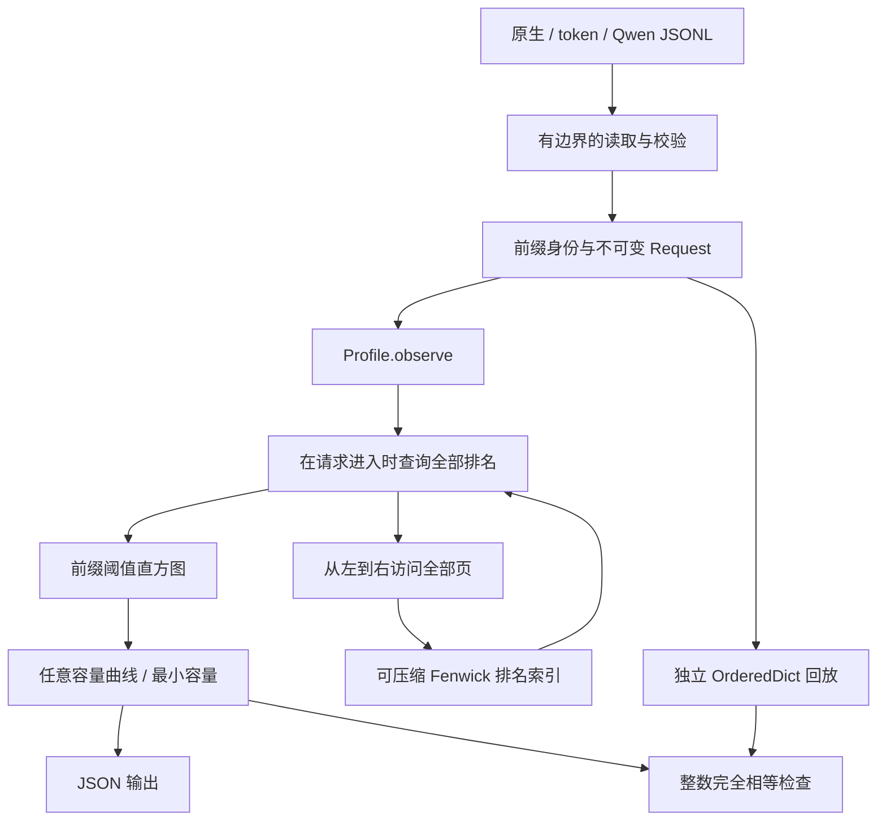

# 架构与 API

[English](../en/ARCHITECTURE.md) · [研究与证明](RESEARCH.md)

## 数据流



运行时只依赖 Python 标准库，核心执行 CPU 元数据分析；运行路径中没有推理服务、模型下载、GPU kernel 或 HTTP 服务。

| 模块 | 职责 | 边界 |
|---|---|---|
| [`model.py`](../../src/prefixscope/model.py) | 不可变 `Request`；容量校验 | 拒绝错误规模与重复页身份。 |
| [`trace.py`](../../src/prefixscope/trace.py) | 流式 JSONL；token／内容标识链接 | 将格式转为统一模型，不重建原文或输出。 |
| [`rank.py`](../../src/prefixscope/rank.py) | Fenwick 排名；时间戳压缩 | 只管理页身份和访问顺序，不处理请求、token 或容量查询。 |
| [`profiler.py`](../../src/prefixscope/profiler.py) | 请求状态转换；直方图；曲线 | 持有分析状态并维持固定块大小契约。 |
| [`reference.py`](../../src/prefixscope/reference.py) | 独立有限 LRU 缓存 | 不调用优化实现的排名索引或直方图。 |
| [`cli.py`](../../src/prefixscope/cli.py) | 参数、分析驱动与输出 | 返回诊断状态并原子替换输出文件。 |

## 公共接口

```python
from prefixscope import Profile, Request, ResourceLimitError, replay
from prefixscope.trace import from_tokens, load_jsonl

request = from_tokens(list(range(72)), namespace="example-model-v1")
profile = Profile(max_unique_pages=1000)
profile.observe(request)
profile.observe(request)
assert profile.curve([0, 4]) == replay([request, request], [0, 4])
assert profile.minimum_capacity(0.4) == 4
profile.clear()
```

示例使用合成整数 token：每个 72-token 请求有四个完整的 16-token 页和八个不能缓存的尾部 token。它演示元数据复用，不是语言模型推理。

| 接口 | 行为与约束 |
|---|---|
| `Request(blocks, input_tokens, block_size=16)` | 冻结对象。`blocks` 须为互不相同的非空字符串元组；整数 token 数非负，块大小为正，且 `len(blocks) == input_tokens // block_size`。整数参数不接受布尔值。 |
| `Profile(max_unique_pages=2_000_000, compact=True, initial_slots=1024)` | 创建空状态，验证正整数上限与布尔压缩开关。默认槽位用于结构内存消融。 |
| `observe(request, measure=True)` | 返回整数前缀阈值或 `None` 的元组。`measure=False` 只预热状态，不计 token。所有请求须使用同一块大小。非法请求和不同页数预算拒绝不改变状态。 |
| `curve(capacities)` | 接受非负整数页容量序列，返回含 `capacity_pages`、`reused_tokens`、`total_tokens`、`hit_rate` 的字典列表；保留顺序和重复容量，空序列返回空列表。 |
| `minimum_capacity(target_hit_rate)` | 目标为 `[0,1]` 内有限数值，不接受布尔值。返回满足目标的最小页数；零目标返回零，不可达返回 `None`。 |
| `stats()` | 返回结构计数；`requests`、`accesses` 包含预热，`measured_requests`、`total_tokens` 不包含预热。`allocated_slots` 不计未使用的零号元素，也不是 RSS。 |
| `clear()` | 释放旧状态引用并分配初始索引，重置直方图、计数和块大小，可开始新分析；不保证操作系统 RSS 立即下降。 |
| `replay(requests, capacities, warmup_requests=0)` | 参考实现接受可迭代请求，每个容量独立使用 `OrderedDict`，输出与曲线同一 schema；预热更新缓存但不参与测量。 |

类型／结构错误产生 `TypeError` 或 `ValueError`；`ResourceLimitError` 是专门表示不同页数预算超限的 `ValueError` 子类。`Profile` 是**单一所有者的可变对象**，不含内部锁。不同 worker 可以各用独立 profile；线程共享时，调用方须序列化整个请求的处理。

## 输入格式与身份

`load_jsonl(path, format="native", limit=None, namespace="default", max_line_bytes=16*1024*1024)` 按文件顺序产出校验后的请求。`limit=0` 不产出请求。每行须为 JSON 对象；空行会报错，不会静默忽略。错误包含从 1 开始的行号。迭代结束或 generator 关闭时释放文件句柄；提前停止迭代的调用方应显式关闭 generator，或使用 `contextlib.closing`。

| 格式 | 必要字段 | 转换 |
|---|---|---|
| `native` | `blocks`、`input_tokens`；可选 `block_size` | 已规范化页标识；拒绝未知字段。调用方负责身份正确性。 |
| `tokens` | `token_ids`；可选 `block_size` | 对非负整数 token 的完整块散列，再链接父前缀身份；不足块仍计入分母。 |
| `qwen` | `input_length`、`hash_ids` | 固定块大小 16；取前 `floor(input_length/16)` 个 hash 再链接，忽略无关轨迹元数据。 |

`chain_blocks` 用 SHA-256 组合格式标记、命名空间、块大小、父摘要、整数编码长度及内容标识，因此相同内容跟在不同前缀后会获得不同身份。命名空间须为 1–1024 个字符，并在模型、分词器、适配器、dtype 或租户不同时加以区分。默认值适合单份轨迹，不会自动检测模型。原生 ID 绕过该转换，必须自行包含必要身份边界。抗碰撞性是一项假设，不是数学上的相等判定保证。

## 状态转换与资源管理

`observe` 在变更状态前检查输入类型、测量开关、块大小一致性和新增不同页数。随后读取全部页排名，将测量请求的前缀最大值加入直方图，再访问所有页，最后推进计数器。首个冷页会关闭可复用前缀，但后续页仍影响未来访问顺序。

压缩排名数组存储 64 位有符号计数，字典保存每页当前位置。压缩保持已占用位置的先后顺序。直方图只保留有限阈值及 token 权重，不保存逐请求记录。证明和摊还界见[复杂度与资源成本](RESEARCH.md#复杂度与资源成本)。

默认读取边界是 **每 JSONL 行 16 MiB**、**每请求 100,000 个完整页**、**每 profile 2,000,000 个不同页**。前两项应用于 `trace.py` 转换；直接构建 `Request` 会做结构校验，但不会自动执行 100,000 页限制，调用方须限制直接输入的请求。`max_unique_pages` 限制身份数量而非字节；过长原生字符串或过大的 `initial_slots` 仍可能占用大量内存。

预算拒绝相对于 profile 状态是原子的，可通过更大预算或其他输入恢复。**系统级 `MemoryError` 不具备事务性**：分配失败可能发生在部分状态变更之后。此时应丢弃 profile，在新 profile／进程中从已知输入边界重放。没有持久化 checkpoint，也不会为了满足预算而静默驱逐分析历史或丢失数据。

## CLI 与输出生命周期

`prefixscope demo` 运行合成示例并与参考回放核对曲线。`prefixscope analyze --help` 用双语说明格式、命名空间、容量页数、预热、请求数限制、不同页数限制、目标与输出路径。已知操作错误返回状态 **2** 并输出诊断；成功返回 **0**。不可达目标是包含 JSON `null` 的正常输出，不是运行失败。

指定 `--output` 时，CLI 序列化有限数值 JSON，在目标目录写入临时文件，然后调用 `os.replace`；预期异常会清理残留临时文件。这能保护已有输出免受普通不完整写入影响，但不是基于 fsync 的断电持久性保证。默认 stdout 输出不具备原子性。JSON 包含 `schema_version` 和模型标识 `serial-request-entry-lru`。

## 设计取舍与安全边界

- `OrderedDict` 是实用基线：直接成员查询及常数时间访问顺序更新在容量较少时可能更快。每容量独立回放也提供独立正确性判据。
- treap 可以只保留有效排名，但需要旋转、平衡和更多对象。压缩 Fenwick 数组更容易审阅，也方便关闭压缩做消融；排序暂停是接受的取舍。
- 直方图避免保留全部请求和逐容量计数，代价是不支持历史逐请求查询，也无法在读取后重建负载到达时间。
- 运行时读取本地文件并写入指定结果，不上传轨迹。命名空间散列提供身份区分，**不提供加密或匿名化**；私有 token、轨迹与派生统计仍需独立处理规范，不能因为 ID 已散列就公开。
- 有边界的输入校验可限制意外资源使用，但程序不是处理恶意数据的沙箱，也不声称提供多租户服务隔离或防御计时攻击。
- 生产 vLLM/SGLang 兼容性、推理加速、GPU 执行、可变大小缓存和并发调度均不在当前模型内，详见[研究范围](RESEARCH.md#数据有效性与外部有效性)。
